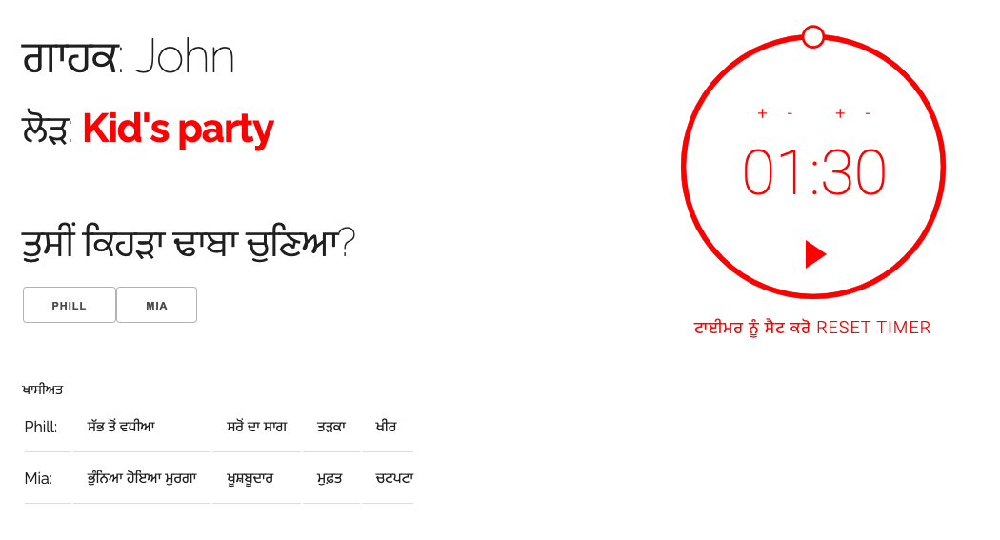

This project is a fork of [Kaizen Castanos' much appreciated web version](https://github.com/kaizenc/FUNemployed-Web-Game).

This version of the game allows for easier customizing and localizing of the game text, as well as adding a round timer.

You can watch this [instructional video](https://www.kaltura.com/index.php/extwidget/preview/partner_id/1038472/uiconf_id/44151201/entry_id/1_0glcnfes/embed/iframe?) of how to easily customize and localize the interface for you own ideas, themes, and languages.

The [instructions document](https://docs.google.com/document/d/1SkY1oTLCxgFNce72_GtUJPIFdEn42u5xhFF4kCE8Nss/edit), and [customization spreadsheet](https://drive.google.com/file/d/16s48Z8v6YrnlQdFuS690cNGusYtPSAK3/view?usp=sharing) referenced in the video above.